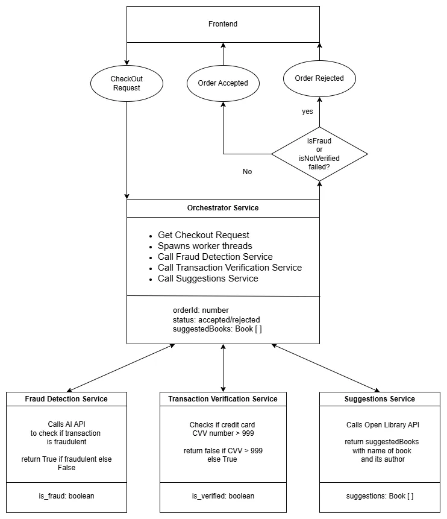

# Documentation

### Architecture Diagram


### System Diagram



## Code Snippets

This section sets up the import paths for gRPC protocol buffer stubs required for:
- Fraud Detection
- Transaction Verification
- Book Suggestions

```python
# Import paths for gRPC stubs
fraud_detection_grpc_path = os.path.abspath(
    os.path.join(FILE, "../../../utils/pb/fraud_detection")
)
transaction_verification_grpc_path = os.path.abspath(
    os.path.join(FILE, "../../../utils/pb/transaction_verification")
)
suggestions_grpc_path = os.path.abspath(
    os.path.join(FILE, "../../../utils/pb/suggestions")
)

# Add paths to system path
sys.path.insert(0, fraud_detection_grpc_path)
sys.path.insert(1, transaction_verification_grpc_path)
sys.path.insert(2, suggestions_grpc_path)

```

## gRPC Service Calls (Fraud Detection, Transaction Verification, and Suggestions)

This section contains functions that communicate with external **gRPC microservices** for fraud detection, transaction verification, and book suggestions. These services run on separate ports and process requests concurrently.


### Fraud Detection Service Call
Checks if a credit card number is flagged as fraudulent.

```python
def call_fraud_detection(number, result):
    try:
        print(f"Starting fraud check request")
        with grpc.insecure_channel("fraud_detection:50051") as channel:
            stub = fraud_detection_grpc.FraudServiceStub(channel)
            response = stub.CheckFraud(fraud_detection.FraudRequest(number=number))
            print(f"Fraud check result received")
            result.put(("is_fraud", response.is_fraud))
    except Exception as e:
        print(f"ERROR in fraud detection: {str(e)}")
        result.put(("is_fraud", True))
```
### Transaction Verification Service Call

Verifies a transaction using the CVV code.

```python
def call_transaction_verification(cvv, result):
    try:
        print(f"Starting transaction verification request")
        with grpc.insecure_channel("transaction_verification:50052") as channel:
            stub = transaction_verification_grpc.TransactionVerificationServiceStub(
                channel
            )
            response = stub.VerifyTransaction(
                transaction_verification.TransactionRequest(id="123", cvv=int(cvv))
            )
            print(f"Transaction verification result received")
            result.put(("is_verified", response.is_verified))
    except Exception as e:
        print(f"ERROR in transaction verification: {str(e)}")
        result.put(("is_verified", False))
```

### Book Suggestions Service Call

Fetches book recommendations based on the user’s comment.

```python
def call_suggestions(comment, result):
    try:
        print(f"Starting book suggestions request")
        with grpc.insecure_channel("suggestions:50053") as channel:
            stub = suggestions_grpc.SuggestionServiceStub(channel)
            response = stub.GetSuggestions(
                suggestions.SuggestionRequest(comment=comment)
            )
            print(f"Book suggestions received")
            response_dict = MessageToDict(response)
            suggestions_list = response_dict.get("suggestions", [])
            result.put(("suggestions", suggestions_list))
    except Exception as e:
        print(f"ERROR in suggestions service: {str(e)}")
        result.put(("suggestions", []))
```

## Thread Management for Concurrent Service Calls

```python
threads = [
    threading.Thread(
        target=call_fraud_detection,
        args=(request_data["creditCard"]["number"], result_queue),
    ),
    threading.Thread(
        target=call_transaction_verification,
        args=(request_data["creditCard"]["cvv"], result_queue),
    ),
    threading.Thread(
        target=call_suggestions,
        args=(request_data["userComment"], result_queue),
    ),
]

print(f"Starting worker threads")
for thread in threads:
    thread.start()

for thread in threads:
    thread.join()
print(f"Threads processing completed")
```

### Collecting Results from Concurrent Services

```python
results = {}
while not result_queue.empty():
    key, value = result_queue.get()
    results[key] = value
print(f"Final results: {results}")
```

### Determining the Order Status

```python
status = "Order Approved"
if results.get("is_fraud", False):
    status = "Order Rejected (Fraud detected)"
elif not results.get("is_verified", False):
    status = "Order Rejected (Transaction verification failed)"
```


