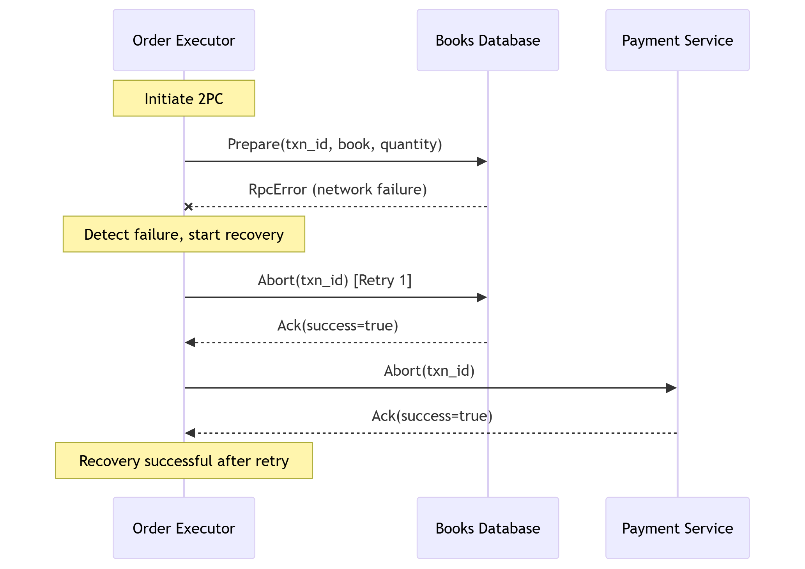
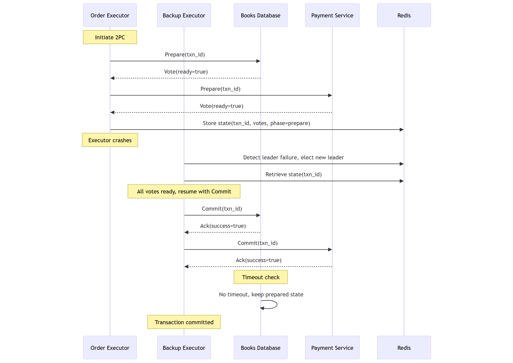

## Bonus Task 1: Handling Failing Participants

### Overview
The first bonus task requires a mechanism to recover from participant failures during the 2PC protocol, ensuring the system remains consistent. Your code implements a basic recovery mechanism in the `ExecutorService._handle_transaction_failure` method, which aborts the transaction on both participants if an error occurs (e.g., a participant fails to prepare or commit).

### Implemented Solution
- **Mechanism**: When an exception occurs during the 2PC process (e.g., a gRPC error indicating a participant failure), the executor calls `_handle_transaction_failure` to send `Abort` requests to both the Database and Payment Service, discarding any prepared changes.
- **Code**:
  ```python
  def _handle_transaction_failure(self, transaction_id):
      logger.warning(f"Attempting recovery for {transaction_id}")
      self.db_client.abort_update(transaction_id)
      self.payment_client.abort_update(transaction_id)
  ```
- **How It Works**:
  - If a participant fails to respond to `Prepare` (e.g., due to a network issue) or returns `Vote(ready=false)` (e.g., insufficient stock in the Database), the executor aborts the transaction.
  - The Database discards reserved stock (`pending_decrements`), and the Payment Service removes the transaction from `prepared_transactions`.
  - This ensures no partial updates occur, maintaining consistency.

### Enhanced Solution
To make the recovery mechanism more robust, we can introduce **retry logic** for transient failures (e.g., temporary network issues) before aborting, and add timeout handling to detect unresponsive participants. Below is the pseudocode for an enhanced recovery mechanism.

#### Pseudocode
```python
function handleTransactionFailure(transaction_id, max_retries, retry_delay):
    log("Attempting recovery for transaction " + transaction_id)
    for attempt from 1 to max_retries:
        try:
            // Attempt to abort on Database
            db_response = db_client.abort_update(transaction_id)
            // Attempt to abort on Payment Service
            payment_response = payment_client.abort_update(transaction_id)
            if db_response.success and payment_response.success:
                log("Recovery successful for transaction " + transaction_id)
                return true
        catch (RpcError e):
            log("Recovery attempt " + attempt + " failed: " + e)
            if attempt < max_retries:
                sleep(retry_delay)
    log("Recovery failed after " + max_retries + " attempts for transaction " + transaction_id)
    return false
```

#### Explanation
- **Retry Logic**: Attempts to abort the transaction up to `max_retries` times, with a `retry_delay` between attempts to handle transient failures.
- **Timeout Handling**: Assumes the gRPC client has a timeout (configurable in `db_client` and `payment_client`), preventing indefinite waits for unresponsive participants.
- **Outcome**: If all retries fail, the system logs the failure, allowing manual intervention or escalation (e.g., alerting an admin).

#### Illustration: Failure Recovery
The following Mermaid sequence diagram illustrates the enhanced recovery mechanism when the Database fails to prepare due to a transient network issue, with the executor retrying before aborting.



- **Flow**:
  - The Database fails to respond to `Prepare` due to a network issue.
  - The Executor detects the failure and initiates recovery, retrying the `Abort` request.
  - The Database responds successfully on the retry, discarding any partial changes.
  - The Payment Service aborts, ensuring no transaction is left prepared.
- **Key Point**: The retry mechanism increases robustness against transient failures, reducing unnecessary aborts.

### Evaluation
- **Strengths**:
  - Your current implementation ensures consistency by aborting on any failure, aligning with 2PC’s atomicity guarantee.
  - The enhanced solution improves resilience to transient issues, reducing the need for manual intervention.
- **Limitations**:
  - The current code doesn’t retry, so transient failures always lead to aborts.
  - No timeout is explicitly defined, which could cause delays if a participant is permanently unresponsive.
- **Recommendation**: Implement the enhanced pseudocode in `ExecutorService` to handle transient failures, e.g.:
  ```python
  def _handle_transaction_failure(self, transaction_id, max_retries=3, retry_delay=1):
      logger.warning(f"Attempting recovery for {transaction_id}")
      for attempt in range(max_retries):
          try:
              db_response = self.db_client.abort_update(transaction_id)
              payment_response = self.payment_client.abort_update(transaction_id)
              if db_response.success and payment_response.success:
                  logger.info(f"Recovery successful for {transaction_id}")
                  return
          except grpc.RpcError as e:
              logger.error(f"Recovery attempt {attempt + 1} failed: {e}")
              if attempt < max_retries - 1:
                  time.sleep(retry_delay)
      logger.error(f"Recovery failed after {max_retries} attempts for {transaction_id}")
  ```

## Bonus Task 2: Analyzing Coordinator Failure

### Analysis
- **Consequences of Coordinator Failure**:
  - **During Prepare Phase**: If the Executor crashes before sending `Prepare` to all participants, some may have prepared (e.g., reserved stock in the Database) while others haven’t. This leaves the system in an inconsistent state, with resources locked until recovery.
  - **After Prepare, Before Commit/Abort**: If the Executor crashes after collecting votes but before sending `Commit` or `Abort`, participants remain in a prepared state, holding resources (e.g., Database’s `pending_decrements`, Payment’s `prepared_transactions`). This blocks stock and transactions until the coordinator recovers or a new coordinator intervenes.
  - **During Commit/Abort**: If the Executor crashes after sending `Commit` to one participant (e.g., Database updates stock) but not the other, the transaction may partially complete, violating atomicity.
- **Impact**:
  - **Blocking**: Participants cannot proceed without the coordinator’s decision, potentially causing delays in order processing.
  - **Resource Lockup**: Reserved stock or prepared payments reduce system availability.
  - **Inconsistency Risk**: Partial commits (rare but possible with unreliable networks) could lead to inconsistent states.

### Proposed Solution
To address coordinator failure, we can use a **backup coordinator** elected via the existing leader election mechanism (already implemented in `ExecutorService` using Redis). Participants can also implement a **timeout-based abort** to release resources if the coordinator doesn’t respond within a set period.

#### Solution Details
- **Backup Coordinator**:
  - Leverage the Redis-based leader election (`elect_leader`) to elect a new executor as the coordinator if the current one fails.
  - Store the 2PC state (e.g., transaction ID, participant votes) in Redis, allowing the backup coordinator to resume the protocol.
- **Timeout-Based Abort**:
  - Participants (Database, Payment Service) track the time since receiving a `Prepare` request. If no `Commit` or `Abort` is received within a timeout (e.g., 30 seconds), they automatically abort, releasing resources.
- **Justification**:
  - **Backup Coordinator**: Reuses the existing leader election, minimizing additional complexity. Storing state in Redis ensures the new coordinator can recover the transaction’s status.
  - **Timeout**: Prevents indefinite blocking, improving availability without sacrificing consistency (aborting is safe in 2PC).
  - **Trade-offs**: Adds Redis dependency for state storage and slight latency for timeouts, but ensures robustness against coordinator crashes.

#### Pseudocode
```python
# Coordinator (ExecutorService)
function executeOrder2PC(order_id, order_data):
    transaction_id = generateUUID()
    state = { "txn_id": transaction_id, "votes": [], "phase": "prepare" }
    storeInRedis("2pc_state:" + transaction_id, state)
    
    for participant in [db_client, payment_client]:
        try:
            vote = participant.prepare_update(transaction_id)
            state.votes.append(vote)
        catch (RpcError e):
            state.phase = "abort"
            storeInRedis("2pc_state:" + transaction_id, state)
            abortAllParticipants(transaction_id)
            return
    storeInRedis("2pc_state:" + transaction_id, state)
    
    if all(state.votes):
        state.phase = "commit"
        storeInRedis("2pc_state:" + transaction_id, state)
        commitAllParticipants(transaction_id)
    else:
        state.phase = "abort"
        storeInRedis("2pc_state:" + transaction_id, state)
        abortAllParticipants(transaction_id)

# Backup Coordinator Recovery
function recoverFailedCoordinator(transaction_id):
    state = retrieveFromRedis("2pc_state:" + transaction_id)
    if state.phase == "prepare":
        if all(state.votes):
            commitAllParticipants(transaction_id)
        else:
            abortAllParticipants(transaction_id)
    else if state.phase == "commit":
        commitAllParticipants(transaction_id)
    else if state.phase == "abort":
        abortAllParticipants(transaction_id)

# Participant (e.g., BooksDatabaseServicer)
function prepare(txn_id, book, quantity):
    start_time = currentTime()
    reserveResources(txn_id, book, quantity)
    prepared_transactions[txn_id] = { "book": book, "quantity": quantity, "start_time": start_time }
    return Vote(ready=true)

function checkTimeout(txn_id, timeout=30):
    if currentTime() - prepared_transactions[txn_id].start_time > timeout:
        abort(txn_id)
```

#### Explanation
- **Coordinator**: Stores 2PC state in Redis, including the transaction ID, votes, and phase. If it crashes, the backup coordinator retrieves this state to resume.
- **Backup Coordinator**: Checks the transaction’s phase and votes to decide whether to commit or abort, ensuring the protocol completes.
- **Participant Timeout**: The Database and Payment Service abort prepared transactions after a timeout, releasing resources (e.g., stock, transaction IDs).

#### Illustration: Coordinator Failure Recovery
The following Mermaid sequence diagram illustrates a coordinator failure after the Prepare phase, with a backup coordinator and timeout-based abort.



- **Flow**:
  - The Executor prepares both participants and stores the state in Redis but crashes before sending `Commit`.
  - The Backup Executor detects the failure via leader election, retrieves the state, and sees all votes are `ready=true`.
  - The Backup sends `Commit` to both participants, completing the transaction.
  - The Database checks for timeouts but doesn’t abort, as the Backup resumes in time.
- **Key Point**: The Redis state and leader election ensure recovery, while timeouts prevent indefinite blocking.